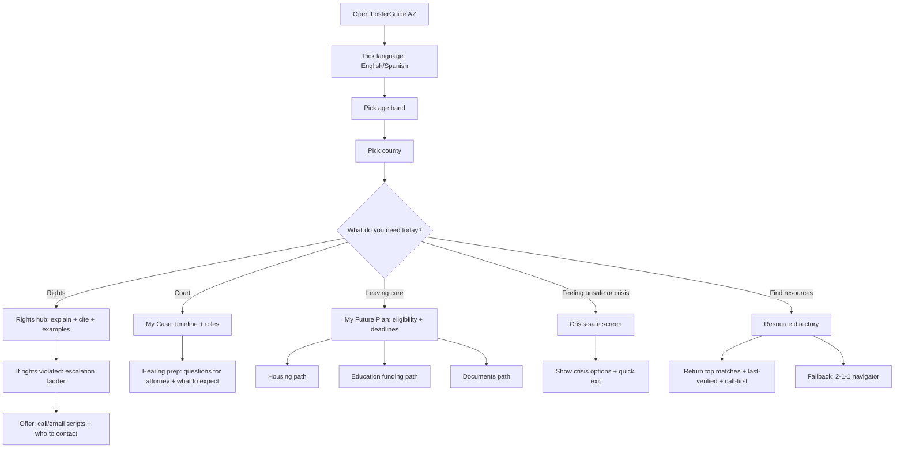
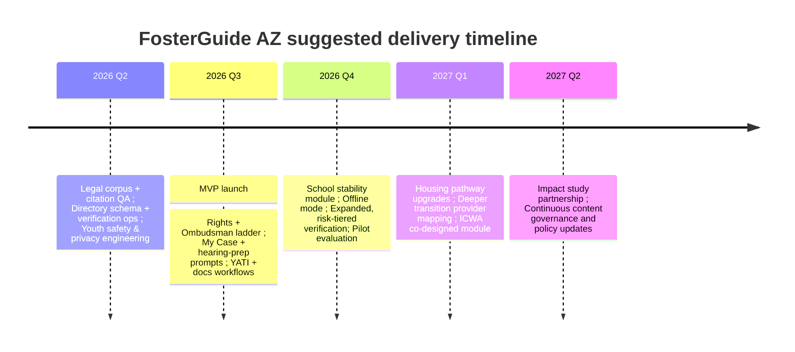

# Arizona Foster Care System Deep Research and FosterGuide AZ Product Specification Evaluation

## Executive summary

Arizona’s foster care system is a multi-agency environment centered on the state child welfare agency, juvenile dependency courts, and a network of contracted providers and nonprofit supports. The most decision-relevant, Arizona-specific factors for a “definitive resource” app are: (a) the youth’s legal rights and how to exercise them in practice; (b) process navigation (dependency stages, roles, hearings, and timelines); (c) transition-to-adulthood eligibility rules and deadlines; and (d) practical access barriers—identity documents, housing, school stability, health/behavioral health access, and trustworthy contacts. Arizona-specific data shows a declining foster care population since 2020, but persistent challenges in placement stability for youth with longer time in care, and materially high rates of reported homelessness and incarceration experiences in the NYTD outcomes reported for Arizona youth. citeturn16view0turn13view0

The attached FosterGuide AZ Product Specification proposes a youth-facing, Arizona-specific, AI-assisted resource app (RAG-based) that intentionally avoids creating a “companion chatbot,” avoids account creation for minors, provides age-tiered content, and emphasizes trauma-informed UX and bilingual English/Spanish support. fileciteturn0file0 The spec is directionally well aligned with the highest-frequency information needs (rights, “what’s happening,” resources, transition planning). It also anticipates several Arizona-specific policy realities (e.g., extended foster care eligibility rules; the success-coaching model and caseload limits; the ETV deadline for the current cycle). citeturn17search0turn17search1turn25search0

Key gaps and risks are less about “missing screens” and more about trust, verification, and safe operationalization: (1) resource directory accuracy at county/provider level (and crisis-safe routing) must be treated as a core product capability, not a content task; (2) the current “collect nothing” posture is strong, but analytics and vendor telemetry can inadvertently reintroduce COPPA/child safety risk if not explicitly engineered; (3) Arizona’s most acute unmet needs—housing transitions and behavioral health access timelines—require workflow-grade features (action steps, call scripts, escalation ladders, and offline/low-bandwidth resilience) rather than “informational pages” alone; and (4) for older youth (16–21), lack of controlled persistence (e.g., locally stored checklists, reminders, and document vault) can materially reduce impact unless addressed with privacy-safe patterns. citeturn13view0turn34view0turn1search3turn35search13

Recommendations are grouped into: (a) content and taxonomy changes (youth tasks first, law second); (b) workflow improvements (rights enforcement, school stability, health access, housing transitions, identity docs); (c) accessibility and trauma-informed enhancements (audio, literacy tiering, offline mode, safe exit alternatives); (d) integrations (verified contacts, 2‑1‑1, AHCCCS/YATI and vital records endpoints, ETV/tuition waiver workflows); and (e) implementation risk controls (verification operations, security, incident response, and evaluation metrics). citeturn35search0turn1search3turn35search1turn25search0turn17search3

## Arizona foster care landscape in practice

### System structure and core entities

Arizona’s foster care system includes at least five “systems” youth must navigate simultaneously:

- Child welfare case management and placements (state agency + providers)
- Juvenile dependency court (hearings, attorneys, judicial orders)
- Education system (school stability, special education decision-making)
- Health and behavioral health coverage and access (AHCCCS, plan/card changes, Jacob’s Law timelines)
- Transition-to-adulthood programming and benefits (extended foster care, transition supports, postsecondary aid)

Arizona law creates a Foster Youth Bill of Rights and enumerates participation, privacy, sibling contact, and complaint/escalation pathways. citeturn1search0 Courts and court-adjacent programs (CASA volunteers and the Foster Care Review Board) support best-interest advocacy and permanency progress monitoring in dependency matters. citeturn30search1turn22search1

image_group{"layout":"carousel","aspect_ratio":"16:9","query":["Arizona counties map","Phoenix Arizona courthouse exterior","Tucson Arizona courthouse","Arizona state capitol building Phoenix"],"num_per_query":1}

### Youth-facing legal and procedural touchpoints that are “app-critical”

A youth “definitive resource” for Arizona must reliably cover (and keep current) a concentrated set of recurring legal topics:

- Rights in care and what to do when rights are violated (including complaint escalation). citeturn1search0turn1search7turn1search11  
- Right to counsel/representation structures (attorney appointment requirements and how representation roles differ in practice). citeturn30search0turn30search19turn20search8  
- Special advocate (CASA) role and duties, including what a CASA can and cannot do. citeturn30search1turn22search0  
- School stability and transportation requirements tied to best-interest determinations when placements change. citeturn17search6turn2search2turn17search2  
- Identity document obligations (birth certificate and other “documents” timelines and responsibilities). citeturn17search3turn17search11turn17search17  
- Extended foster care eligibility and the connected success-coaching model (including caseload caps and reporting). citeturn17search0turn17search1turn13view0turn33view2  
- Exit-to-housing policy obligations for young adults leaving care without permanent family. citeturn30search2  
- Postsecondary supports (Arizona tuition waiver scholarship statute; ETV eligibility and deadlines). citeturn2search3turn25search0  
- Indian Child Welfare Act alignment resources for Arizona courts and how ICWA intersects with Arizona removals, dependencies, guardianships, and terminations. citeturn29view0turn28search5

### Arizona-specific contact points that are repeatedly needed

The app’s “hotline layer” should treat these as first-class primitives (searchable, pinned, and always reachable):

| What a youth needs right now | Arizona contact point | Why it matters for the product |
|---|---|---|
| Report child abuse/neglect | Statewide child abuse hotline (listed on the state child safety agency contact page) citeturn1search4 | Always-available, crisis-adjacent routing and mandated response pathway |
| File/resolve a complaint about agency action or inaction | Ombudsman contact (phone + email on the complaint/disagreement page) citeturn1search7 | Directly supports “rights enforcement,” not just “rights education” |
| Find local services beyond foster-specific programs | entity["organization","211 Arizona","statewide, arizona, us"] (hours and phone options listed on their site) citeturn35search0turn35search4 | A “catch-all” directory with human navigators; good fallback when the app is uncertain |
| Health coverage for youth leaving care | entity["organization","Arizona Health Care Cost Containment System","medicaid agency, arizona, us"] YATI page (eligibility 18–26; no premiums for those who qualify) citeturn1search3 | Critical “what happens when I turn 18?” question; must be accurate and simple |
| In-care health plan | Mercy Care DCS Comprehensive Health Plan page describing coverage for youth in out-of-home care citeturn1search2turn19search16 | Reduces care delays and confusion about where to call and what card to use |
| Find the closest field office | Field office listing page with local phone numbers and addresses citeturn1search1 | Needed when youth are trying to contact caseworkers or escalate |
| Kinship supports | Kinship support email + warm line listed on the kinship resource page citeturn2search8 | Kin placements are common; caregivers often need fast guidance |

## Arizona foster care data and outcomes

### Foster care population, entries/exits, and length of stay

Federal AFCARS-derived reporting for Arizona shows a multi-year decline in children in foster care on September 30 from FY 2020 to FY 2024 (13,717 to 9,058). citeturn16view0 This matters for product design because needs are not evenly distributed: fewer children in care does not imply fewer complex cases, and the most service-intensive segments (older youth, long stays, high placement churn) remain present. citeturn31view0turn13view0

The same Arizona AFCARS-derived table also reports FY 2024 entries (5,335) and exits (6,704), along with a reported median length of stay around 14.4 months. citeturn16view0

### Demographics relevant to equity and language access

Arizona’s foster care population includes a high proportion of Hispanic youth (about 39.4% of children in foster care on 9/30 in FY 2024 in the AFCARS-derived race/ethnicity table). citeturn23view0 This supports the product specification decision to launch in English and Spanish, but also raises a quality bar: Spanish must be workflow-accurate (forms, deadlines, legal meaning), not just UI translation. citeturn23view0turn0file0

The same table indicates meaningful representation of American Indian/Alaska Native youth (about 6.4% on 9/30 FY 2024), reinforcing the importance of ICWA-aware navigation and tribal partnership co-design rather than “generic ICWA facts.” citeturn23view0turn29view0

### Placement stability, reentry, and case practice signals

Arizona placement stability varies sharply by time in care. For FY 2024, among children in care 24 months or longer, about 65.3% had 3 or more placements (and about 34.6% had 2 or fewer). citeturn31view0 This aligns with a product emphasis on (a) school stability workflows, (b) “who can I ask for help” escalation ladders, and (c) practical coping and support routing, because placement churn is an “experience driver” of educational disruption and mental health strain. citeturn17search6turn34view0turn31view0

Reentry metrics show a non-trivial share of entries involve reentry after a prior foster care episode (both within 12 months and beyond 12 months), indicating a cohort of youth and families who may be interacting with the system repeatedly and may benefit from better early-stage navigation and preventive supports. citeturn31view3

### Youth transition outcomes reported for Arizona

Arizona’s reported NYTD outcome measures (summarized in the Arizona Auditor General’s young adult program report) include high rates of “experienced homelessness” and “experienced incarceration” in the survey responses: for example, 38% of surveyed 17‑year‑olds reported experiencing homelessness (lifetime measure), and 21% of surveyed 19‑year‑olds reported homelessness experience in the prior two years. citeturn13view0 These are not identical to “homelessness within 18 months of aging out,” but they are strong Arizona-specific signals that housing navigation and crisis-safe routing should be treated as first-order product requirements. citeturn13view0turn30search2

The same NYTD summary table shows education and employment status signals (e.g., high school diploma/GED and employment percentages at ages 17 and 19), underscoring the need for “actionable” education and work pathways rather than static lists. citeturn13view0turn35search3

## Common challenges and unmet needs for Arizona foster youth

### High-impact needs that repeatedly surface in Arizona sources

**Housing insecurity and transition cliffs.** Arizona-specific reporting emphasizes transition-to-adulthood supports and the risk of homelessness, with NYTD measures reflecting substantial self-reported homelessness experience. citeturn13view0 State law also now explicitly requires a housing-access policy for young adults leaving care (deadline baked into statute), which increases both the importance and the volatility of “what help exists right now” content. citeturn30search2

**Behavioral health access and timeliness.** Arizona’s “Jacob’s Law” framework is described in state materials as establishing timelines to improve access to behavioral health services for children in foster care and adoptive settings. citeturn21search3turn19search16turn34view0 For an app, this translates into a specific workflow need: “If therapy hasn’t started in X days, here’s who to call next and what to say,” plus a way to surface the relevant escalation steps without re-traumatizing youth. citeturn34view0turn19search16

**Education disruption and low graduation outcomes.** Arizona reporting on foster youth education has highlighted a graduation rate markedly below the statewide average in cited studies and summaries, with a frequently repeated figure around 33% graduation for students in foster care (versus ~78% statewide in a referenced period). citeturn10search11turn10search19 Coupled with school stability requirements and arbitration/transportation processes, this supports a product focus on school-of-origin stability, immediate enrollment, and special education decision-making supports. citeturn2search2turn17search6turn30search14

**Identity documents and bureaucratic friction.** Arizona statute and policy materials emphasize timely procurement and preservation of key identity documents (birth certificates, IDs, immunization records), but the lived experience often includes missing or inaccessible documents during placement changes or upon exit. citeturn17search3turn17search11turn35search13turn35search18

**Information asymmetry and “who is responsible.”** The Arizona Auditor General’s report on young adult programming documents capacity and process issues (e.g., staffing vacancies; inconsistent transition plan completion; and gaps in written procedures for monitoring success coaching metrics). citeturn13view0turn12view0 For an app, the implication is that youth often need a “self-advocacy ladder” that does not assume the system will proactively provide complete, timely explanations. citeturn1search7turn13view0

### Arizona-specific program landscape that can help meet these needs

**Extended foster care and success coaching.** Arizona statutes set eligibility and define the comprehensive service model, including success coach caseload limits and reporting expectations. citeturn17search0turn17search1 The Arizona Auditor General reports that the success coaching program contracted with six provider organizations and identifies implementation and oversight challenges to address. citeturn33view2turn12view0

**Education supports: tuition waiver + ETV.** Arizona law provides for tuition waiver scholarships to eligible students with foster care experience, including an age criterion under current statute language. citeturn2search3turn25search1 Arizona’s ETV program is administered through a specialized provider site that posts the current-cycle deadline (for the 2025–2026 academic year, deadline stated as July 31, 2026). citeturn25search0

**Health coverage continuity: in care vs. post-care.** Arizona’s Medicaid agency describes YATI as transitional coverage for young adults leaving foster care (age 18–26) and provides member-facing materials about coverage transitions. citeturn1search3turn1search16

**Housing and transitional programs.** Arizona has a mix of provider-run and nonprofit-run transitional housing models for foster youth alumni, including programs that explicitly position themselves for foster-care transitions. citeturn36search3turn36search2turn36search0turn37search10 These are high-value directory entries but also high-risk for staleness, eligibility complexity, and capacity constraints (waitlists), which must be represented transparently. citeturn35search0turn36search20

## FosterGuide AZ product specification evaluation

### What the specification gets right for Arizona

The document proposes an Arizona-specific AI-powered information tool built around a constrained RAG approach with explicit guardrails, age-tiered responses, trauma-informed UX patterns (e.g., quick exit, content notes), and bilingual English/Spanish at launch. fileciteturn0file0 These choices are well aligned with Arizona’s demonstrated needs for rights literacy, process navigation, and practical resource connection—particularly under conditions of placement churn, missing documents, and uneven transition planning execution. citeturn31view0turn13view0turn17search3

The spec’s “My Future Plan” focus (extended foster care vs. leaving care; deadlines; education funding; identity documents) aligns with Arizona’s statutory extended foster care framework and the observed youth outcome risks reported via Arizona NYTD measures. citeturn17search0turn17search1turn13view0turn0file0

The spec also correctly treats ETV as deadline-sensitive and operationally complex; the current Arizona ETV administrator site publicly states a July 31 deadline for the 2025–2026 academic year cycle. citeturn25search0turn0file0

### Gaps, misalignments, and “risk-bearing assumptions” in the current spec

**Arizona foster care population claims should be tightened and sourced.** The spec’s headline numbers (e.g., “~10,000 children in foster care” and comparative ranking assertions) should be replaced with time-stamped, source-attached figures. Federal AFCARS-derived reporting shows 9,058 children in foster care on 9/30 FY 2024 in Arizona. citeturn16view0turn0file0

**Graduation outcome claims need precise definitions and citations.** The spec claims a 4-year graduation rate figure and “lowest of any demographic.” Arizona sources often cite ~33% graduation for foster youth in referenced study periods; the app should present this as “reported in [study period]” and link to the underlying report or official summary. citeturn10search11turn10search19turn0file0

**“Collect nothing” is strong, but analytics and AI vendor telemetry are silent failure modes.** The spec proposes privacy-preserving aggregate analytics; however, any analytics implementation must be audited for persistent identifiers, cookies, SDK telemetry, and server logs—especially because the product is child-directed and serves users as young as 10. fileciteturn0file0

**Workflow risk: key needs require escalation ladders, not just Q&A.** Arizona’s strongest “pain points” (housing instability risk; behavioral health timelines; school stability disputes; document retrieval hurdles) are fundamentally workflow problems. The spec gestures at checklists and guides, but to be “definitive,” it must operationalize escalation: “who to contact next,” “what to say,” “what proof to gather,” and “how to document attempts,” including youth-safe phrasing and minimal data retention. citeturn34view0turn17search6turn35search13turn13view0turn0file0

**Verification operations are under-scoped relative to the product promise.** Monthly verification for a 100+ resource directory is a good start, but some categories (housing openings, crisis supports, office hours, provider eligibility) change faster than monthly. The spec will need a risk-tiered verification cadence plus visible “last verified” stamps and “capacity unknown / call first” patterns. citeturn35search0turn0file0

### Feature-to-need alignment table with prioritized improvements

| Arizona youth need (evidence) | Spec feature coverage | Gap to close | Recommendation priority |
|---|---|---|---|
| Rights literacy + how to enforce rights citeturn1search0turn1search7 | “Know Your Rights,” violation walkthrough, citations fileciteturn0file0 | Needs an escalation ladder that matches real channels (caseworker → supervisor → ombudsman → court/attorney) and supports youth documentation without creating unsafe data trails | High |
| Understanding the dependency journey and roles citeturn20search1turn22search1 | “My Case Explained” timeline and “Who’s who” fileciteturn0file0 | Youth often need “what should I do before my next hearing” scripts and question lists keyed to hearing type | High |
| School stability during placement changes citeturn2search2turn17search6 | Mentioned inside rights/case content fileciteturn0file0 | Missing a dedicated “School” workflow: best-interest determination basics, transportation dispute steps, and a youth-friendly “school-of-origin” explainer | High |
| Behavioral health access timelines (Jacob’s Law) citeturn34view0turn19search16 | Wellness check-in + referral cues fileciteturn0file0 | Needs concrete escalation steps and a “how to ask for help” script, with non-clinical boundaries and emergency routing | High |
| Housing transition risk and high homelessness experience citeturn13view0turn30search2 | Resource finder + future plan + directory fileciteturn0file0 | Must represent eligibility, capacity, and waitlist transparency; add “what to do tonight” emergency pathway and 2‑1‑1 handoff | High |
| Identity documents and replacements citeturn17search3turn35search13turn35search18 | Document checklist in “My Future Plan” fileciteturn0file0 | Add step-by-step Arizona workflows (eligibility + where to apply + fees + alternatives), plus local offline “document vault” pattern | Medium |
| Postsecondary funding deadlines (ETV, tuition waiver) citeturn25search0turn2search3 | ETV + tuition waiver checkers and deadline tracker fileciteturn0file0 | Deadline volatility: needs automatic yearly rollover and human verification; add “common rejection reasons” and “who can certify” help | Medium |
| ICWA-aware guidance and tribal resources citeturn29view0turn23view0 | ICWA-aware timeline + tribal indicator fileciteturn0file0 | Requires explicit tribal co-design and a “what questions to ask your caseworker/attorney” module; avoid generic summaries | Medium |

### Suggested content taxonomy and navigation for “definitive” use

A youth-first taxonomy should be task-based (what the youth is trying to do), then back-link to the legal authority:

**Home**
- “I need help right now” (crisis + safe routing)
- “What’s happening in my case?”
- “What are my rights?”
- “School”
- “Health & feelings”
- “Turning 18 / leaving care”
- “Find a place / housing”
- “Documents”

**Rights**
- Safety & placement
- Privacy & communication
- Family & sibling connection
- School & records
- Participating in decisions
- Complaints and getting help

**My case**
- Timeline stages (but with “my next step” prompts)
- Roles (attorney for child vs. GAL vs. CASA volunteer; court staff; review boards) citeturn30search0turn30search1turn22search1
- Hearing prep toolkits (questions to ask, what to bring, what to tell your attorney)

**My future**
- Extended foster care eligibility and decision support citeturn17search0turn17search1
- Education funding (ETV + tuition waiver) citeturn25search0turn2search3
- Work and training (ARIZONA@WORK locator) citeturn35search3
- Housing pathways (transitional programs + general supports, including 2‑1‑1) citeturn35search0turn37search10
- Health coverage after care (YATI) citeturn1search3
- Documents (birth certificate → ID → SSN replacement guidance) citeturn35search13turn35search18

**Resources**
- Need-based search (food, shelter, legal, school, health, money, parenting, LGBTQ+ support, tribal resources)
- County filter + “statewide / remote OK”
- “Last verified” + “call-first” flags

### Required integrations and verification mechanisms

To meet the “definitive resource” claim, integrations should prioritize **verification and safe routing** over “feature flash”:

- **Directory backbone:** integrate (at minimum via linking and structured import) with entity["organization","211 Arizona","statewide, arizona, us"] as a verified general-resource fallback and escalation option; build dedupe/normalization across local entries. citeturn35search0  
- **Postsecondary:** integrate the Arizona ETV administrator application workflow (link + guided steps; no credential handling inside the app) and maintain a year-aware deadline service. citeturn25search0  
- **Health coverage:** deep link into YATI member information and explain coverage transitions from foster-care plan arrangements to other AHCCCS coverage at age 18. citeturn1search3turn1search16  
- **Vital records:** link to the state vital records hub and provide county-level options when relevant (with fee-change warnings and “last verified” dates). citeturn35search1turn35search13  
- **Employment:** office locator linking for ARIZONA@WORK plus local contact patterns. citeturn35search3  
- **Complaints/escalation:** link directly to the complaint/disagreement pathway and show the Ombudsman contact details with a “What to include” checklist. citeturn1search7  

Operationally, a “living directory” needs:
- risk-tiered re-verification intervals (e.g., weekly for housing capacity signals; monthly for stable org contacts; quarterly for statutory summaries)
- public “last verified” stamps and version history
- a human escalation path when the AI is uncertain (including 2‑1‑1 handoff and ombudsman guidance where appropriate) citeturn35search0turn1search7turn0file0

### Mermaid user-journey flowchart

## Roadmap, implementation risks, metrics, and stakeholders

### Phased roadmap with estimated effort

| Phase | Deliverable | Effort | Why it’s sequenced here |
|---|---:|---:|---|
| Foundation | Verified Arizona legal corpus + citation system (rights, EFC eligibility, school stability, docs, tuition waiver) | High | If citations aren’t reliable, trust collapses; also supports QA automation citeturn17search0turn23view0turn2search3 |
| Foundation | Resource directory data model + verification ops (risk-tiered cadence, “last verified,” audit trail) | High | A “definitive” directory is an operations capability; start early citeturn35search0 |
| MVP | Rights hub + escalation ladder + ombudsman workflow | Medium | Directly addresses rights enforcement pathway citeturn1search7turn1search0 |
| MVP | School stability module (best-interest determination, transportation disputes, special education decision support pointers) | Medium | Education disruption is high impact and Arizona has explicit guidance materials citeturn2search2turn17search6turn30search14 |
| MVP | “Turning 18” workflows: EFC decision support + YATI + documents | High | High-risk cliff; must be actionable and time-aware citeturn17search0turn1search3turn35search13 |
| MVP | Offline/low-bandwidth core: cache rights + top contacts + saved checklists locally | Medium | Many youth have constrained connectivity; resilience improves safety and usability citeturn35search0turn1search7 |
| Expansion | Housing pathway upgrades (capacity flags, eligibility filters, “what to do tonight,” 2‑1‑1 handoff) | High | Directly targets highest-severity outcomes signal (homelessness experience) citeturn13view0turn35search0 |
| Expansion | Provider-specific transition services map (success coaching contractors, TILP pathways, re-entry guidance) | Medium | Aligns to Arizona implementation reality and the contractor ecosystem citeturn33view2turn21search2 |
| Scale | Impact evaluation partnership + outcome-oriented research design | Medium | Necessary to prove value without collecting sensitive personal data citeturn13view0turn0file0 |

### Mermaid timeline

### Implementation risks and mitigations

**Resource accuracy and liability risk.** The biggest real-world harm mode is stale or incorrect “next step” guidance (wrong number, wrong office, expired eligibility, changed deadline). Mitigate with (a) verification ops, (b) “last verified” stamps, (c) “call-first” warnings for capacity-limited services, and (d) conservative AI fallback to human navigators (2‑1‑1) and official complaint channels when confidence is low. citeturn35search0turn1search7turn0file0

**Child privacy and unintended data collection.** Even if the app avoids accounts, analytics and third-party AI infrastructure can collect persistent identifiers or retain logs. Mitigate with explicit no-log contracts, self-hosted or privacy-audited analytics configurations, strict telemetry disabling, and a security review that treats “user text” as sensitive even if not stored intentionally. fileciteturn0file0

**Workflow mismatch risk.** Arizona has specific pathways (e.g., extended foster care program requirements; success coach caseload limits; the ombudsman pathway; school stability arbitration references in education guidance). Mitigate with a standing Arizona legal review cadence and a “policy-change watchlist” keyed to statutes and agency guidance. citeturn17search0turn17search1turn17search6turn1search7

**Equity and cultural safety risk (ICWA and tribal specificity).** An “ICWA-aware toggle” without tribal co-design can easily become inaccurate or culturally unsafe. Mitigate with tribal stakeholder governance and alignment with Arizona courts’ ICWA guidance approach. citeturn29view0turn23view0

### Metrics and KPIs that fit the privacy posture

Given the spec’s “aggregate-only” measurement posture, KPIs should prioritize task completion signals rather than user profiling:

- **Task completion rate** for top workflows (e.g., “found ombudsman contact,” “opened YATI eligibility page,” “downloaded birth certificate form,” “found 2‑1‑1”). citeturn1search7turn1search3turn35search13turn35search0  
- **Safety routing correctness** (audit-based): crisis triggers lead to crisis-safe screen and appropriate resources, measured via structured test suites rather than real user logs. citeturn0file0  
- **Directory trust metrics:** percent of directory entries “verified within target SLA,” and “user-reported wrong info” rate. citeturn35search0turn0file0  
- **Equity access:** Spanish usage rate and Spanish workflow completion parity relative to English. citeturn23view0turn0file0  
- **Outcome-proxy surveys (opt-in for 18+ only):** periodic lightweight surveys about resource access success, without collecting case details. citeturn13view0turn0file0  

### Stakeholders to consult

| Stakeholder role | Suggested Arizona stakeholder examples | What they validate |
|---|---|---|
| Foster youth lived-experience governance | Youth advisory members recruited through court/community pathways (compensated) citeturn0file0 | Tone, trust, usability under placement conditions, what “definitive” means in reality |
| Foster youth rights and advocacy | entity["organization","Fostering Advocates Arizona","statewide, arizona, us"] citeturn21search0 | Youth rights content prioritization; escalation ladder realism; language accessibility |
| No-cost legal services provider with youth/foster interface | entity["organization","ALWAYS","phoenix, az, us"] citeturn20search10 | Legal boundary design; safe “information not advice” UX; referral correctness |
| Transition programming and workforce prep | entity["organization","Arizona Friends of Foster Children Foundation","phoenix, az, us"] citeturn21search5 | Transition workflows and youth readiness; employment/education navigation |
| Transition service delivery contractor ecosystem | entity["organization","Arizona’s Children Association","phoenix, az, us"] citeturn21search6 | Eligibility and referral pathways for transition programs; re-entry guidance alignment |
| Behavioral health system oversight | AHCCCS children’s system reporting and Jacob’s Law timelines (validate escalation scripts) citeturn34view0turn19search16 | Behavioral health access steps; timeline accuracy; safe routing |
| Education stability and special education | entity["organization","Arizona Department of Education","phoenix, az, us"] foster care education guidance citeturn2search2 | School stability flows and dispute processes; education decision-making |
| Higher education foster youth campus programs | entity["organization","Arizona State University","tempe, az, us"] foster youth resources pages citeturn25search3 | Postsecondary reality checks: timelines, forms, and common failure points |
| Court improvement / ICWA committee guidance | Arizona courts ICWA guide framing and update cadence citeturn29view0 | ICWA module correctness, tone, and research practices |
| Housing-focused foster youth alumni programs | entity["organization","Foster Arizona","phoenix, az, us"] or entity["organization","New Culture","arizona, us"] citeturn37search10turn36search0 | “What youth actually need tonight,” capacity/eligibility representation, safe housing pathways |
| State oversight and accountability | entity["organization","Arizona Auditor General","phoenix, az, us"] report findings on transition programming citeturn13view0 | System-level risks to design around (process gaps, monitoring gaps, staffing constraints) |
| Executive/system policy leadership | entity["politician","Katie Hobbs","arizona governor"] public statements on support and foster family capacity citeturn15search9 | Contextual policy direction; partnership feasibility and scaling constraints |

